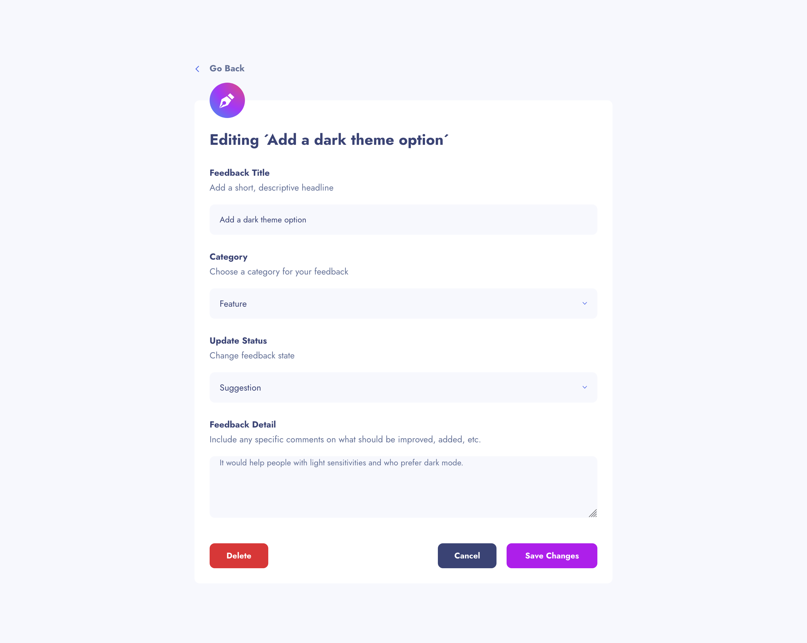

# Product feedback app

## Table of contents

- [Overview](#overview)
  - [Screenshot](#screenshot)
  - [Links](#links)
  - [Built with](#built-with)
  - [What I learned](#what-i-learned)
  - [Continued development](#continued-development)
  - [Useful resources](#useful-resources)
- [Author](#author)
- [Acknowledgments](#acknowledgments)

## Overview

Users are be able to:

- View the optimal layout for the app depending on their device's screen size
- See hover states for all interactive elements on the page
- Create, read, update, and delete product feedback requests
- Receive form validations when trying to create/edit feedback requests
- Sort suggestions by most/least upvotes and most/least comments
- Filter suggestions by category
- Add comments and replies to a product feedback request
- Upvote product feedback requests
- Keep track of any changes, even after refreshing the browser

### Screenshot




### Links

- Solution URL: [https://github.com/12Ricky0/feedback-app.git](https://github.com/12Ricky0/feedback-app.git)
- Live Site URL: [Add live site URL here](https://your-live-site-url.com)

### Built with

- Tailwind CSS
- TypeScript
- MongoDB
- Mobile-first workflow
- [Mongoose](https://mongoosejs.com/) - JS library
- [Next.js](https://nextjs.org/) - React framework

### What I learned

Use this section to recap over some of your major learnings while working through this project. Writing these out and providing code samples of areas you want to highlight is a great way to reinforce your own knowledge.

To see how you can add code snippets, see below:

```html
<h1>Some HTML code I'm proud of</h1>
```

```css
.proud-of-this-css {
  color: papayawhip;
}
```

### Continued development

Use this section to outline areas that you want to continue focusing on in future projects. These could be concepts you're still not completely comfortable with or techniques you found useful that you want to refine and perfect.

**Note: Delete this note and the content within this section and replace with your own plans for continued development.**

## Author

- Frontend Mentor - [@12Ricky0](https://www.frontendmentor.io/profile/12Ricky0)
- Instagram - [@temple4b](https://www.instagram.com/temple4b)

## Acknowledgments

This is where you can give a hat tip to anyone who helped you out on this project. Perhaps you worked in a team or got some inspiration from someone else's solution. This is the perfect place to give them some credit.
